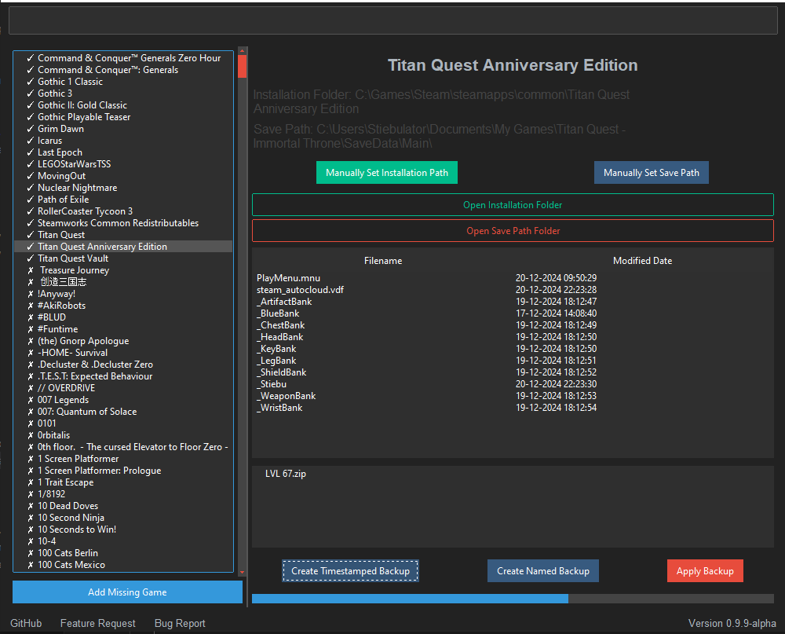

# GameSaveVault
A program to manage saveFiles, allowing easy backups, giving access to more SaveSlots per game and so on.

![Stars][Badge Stars] ![Watcher][Badge Watchers] ![Forks][Badge Forks]

![Black][Badge Black] ![Badge Last Commit][Badge Last Commit] ![Badge Security Policy][Badge Security Policy] ![Badge Open Issues][Badge Open Issues] ![Badge Open Pull Requests][Badge Open Pull Requests] ![Badge Contributors][Badge Contributors] ![Downloads][Badge Downloads] ![License][Badge License]

 [![Join us on Discord][Badge Discord]][Link Discord]

> Savepaths may be wrong and are incomplete. Please contribute to the database. (WORK IN PROGRESS, full Steam/GOG/Epic Game Data Catalog coming in a different Repo with an API)

> All known SavePaths are dynamically created and may be incorrect, incomplete or not avaiable. The biggest part are best estimates to what is known to Steam and a small part is carefully handcrafted. You can override a SavePath if you find it to be incorrect or mislocated. You can also add your own Games and Paths if one would be missing.
Therefore, be sure when creating a backup you don't accidentally backup your whole game and so on. Many paths will need fine-tuning, but usually should be already in a somewhat correct directory.

For more screenshots see [here](SCREENSHOTS.md)

# Table of Contents
1. [Roadmap](#roadmap)
2. [Overview](#overview)
3. [Transparency](#transparency)
4. [Features](#features)
5. [Built With](#built-with)

## Roadmap

(In Order)

> Up until next week
- Extend the Information saved about Games. Data is already avaiable but needs ALOT processing (360k Files, 2GB Data just text)
  - Make it more clear which games need a path (add games that have no path to our database)
  - Add header_images from Steam, GOG and Epic Games (already avaiable as data but need to implement)
  - Add game resources for some Games (Steam Manual, etc.)
    - THIS BASICALLY REWORKS THE WHOLE KNOWNGAMEPATHS!
---
Then to allow easier contribution
> Near februrary
- Publish the API directory for this program so every1 can work on the dataset
  - needs some polish and some development still

- Add GOG Library (already written, just needs implementation)

- Extend the Path-Database to Linux and Mac

## Overview

The **GameSaveVault** is a tool that allows users to manage their game save files and installation paths. It walks through known save paths to detect installed games, integrates Steam and Epic Games registry data to automatically detect installed games, 
while also allowing for manual overriden. You can create easy and fast backups, name them and later execute game specific actions aswell.

It allows for easy integration for per-Games functionality, so feel free to contribute full fledgeg SaveFile-Editors aswell. You wouldn't even need to port them; but we could link them per Game for easy Installation, remember theyr'e installation path and allow for fast execution from within the tool.

## Transparency

> As usual with pyinstaller and python scripts, it may be detected as virus which is a false-positive. We are working on fixing it.  For more details how we determine where you're games are at and so on, see [Security MarkDown](SECURITY.md).

## Features

- **Game Detection**: Automatically detects installed games by reading known save paths aswell as Steam and Epic registry data. (See #transparency)
- **Custom Path Setup**: Users can manually override installation and save paths for games.
- **Extended Save Slots**: You're game is limited on SaveSlots? No problem.
- **Backup and Restore**: Create backups of save files and restore them as needed.
- **Fast switch between Set-Ups**: You have multiple SetUps for different Speed- or Challengeruns? Now you can switch between them quickly.
- **File Explorer**: Open installation and save folders directly from the tool, without browsing or knowing where they could be.
- **Per Game Functionality**: Quick access links for resources to your favorite game.
- **Seamless Steam Integration**: Seamless Steam-Data integration. Updates gameData we can get from Steam on a weekly basis. 

## Built with
> Python, powered by tkinter + TTKBootstrap

- `ttkbootstrap`: A modern theme for `tkinter` used to create a user-friendly graphical interface.
- `json`: For loading and saving game and path data.
- `zipfile`: For creating and extracting ZIP backups of save files.
- `shutil`: For file and directory manipulation.
- `os`: For interacting with the filesystem.
- `tkinter`: For building the graphical user interface (GUI).

<!-- Define URL aliases for badges -->
[Badge Stars]: https://img.shields.io/github/stars/JulianStiebler/GameSaveVault?style=social
[Badge Watchers]: https://img.shields.io/github/watchers/JulianStiebler/GameSaveVault?style=social
[Badge Forks]: https://img.shields.io/github/forks/JulianStiebler/GameSaveVault?style=social

[Badge Black]: https://img.shields.io/github/actions/workflow/status/JulianStiebler/GameSaveVault/black.yml?branch=main&label=Black-Formatter&logo=github&logoColor=white&style=for-the-badge
[Badge Release Version]: https://img.shields.io/github/v/release/JulianStiebler/GameSaveVault?style=for-the-badge&logo=empty
[Badge Release Date]: https://img.shields.io/github/release-date/JulianStiebler/GameSaveVault?style=for-the-badge&logo=empty
[Badge Code Size]: https://img.shields.io/github/languages/code-size/JulianStiebler/GameSaveVault?style=for-the-badge&logo=empty

[Badge Last Commit]: https://img.shields.io/github/last-commit/JulianStiebler/GameSaveVault?style=for-the-badge&logo=empty
[Badge Security Policy]: https://img.shields.io/badge/Security-Policy-red.svg?style=for-the-badge&logo=empty
[Badge Open Issues]: https://img.shields.io/github/issues-raw/JulianStiebler/GameSaveVault?style=for-the-badge&logo=empty
[Badge Open Pull Requests]: https://img.shields.io/github/issues-pr-raw/JulianStiebler/GameSaveVault?style=for-the-badge&logo=empty
[Badge Contributors]: https://img.shields.io/github/contributors/JulianStiebler/GameSaveVault?style=for-the-badge&logo=empty
[Badge Docstring Coverage]: https://img.shields.io/badge/docstr%20coverage-90%25-blue?style=for-the-badge&logo=empty

[Badge Downloads]: https://img.shields.io/github/downloads/JulianStiebler/GameSaveVault/total?style=for-the-badge&logo=empty
[Badge License]: https://img.shields.io/github/license/JulianStiebler/GameSaveVault?style=for-the-badge&logo=empty

[Badge Discord]: https://img.shields.io/badge/Discord-Join%20Us-blue
[Link Discord]: https://discord.gg/ZR8dwkfw

<!-- Aliases for Files -->
[MD Security]: ./SECURITY.md
[MD Screenshots]: ./SCREENSHOTS.md