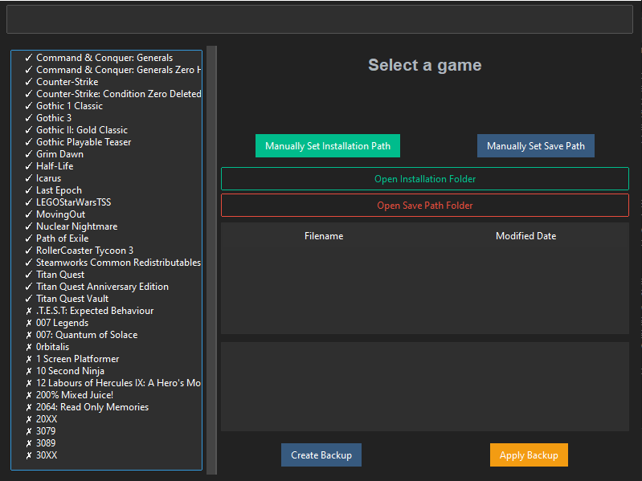

# GameSaveVault
A program to manage saveFiles, allowing easy backups, giving access to more SaveSlots per game and so on.

### Work in Progress, initial Commit soon

## Overview

The **GameSaveVault** is a tool that allows users to manage their game save files and installation paths. It walks through known save paths to detect installed games, integrates Steam and Epic Games registry data to automatically detect installed games, 
while also allowing for manual overriden. You can create easy and fast backups, name them and later execute game specific actions aswell.

It allows for easy integration for per-Games functionality, so feel free to contribute full fledgeg SaveFile-Editors aswell. You wouldn't even need to port them; but we could link them per Game for easy Installation, remember theyr'e installation path and allow for fast execution from within the tool.

## Features

- **Game Detection**: Automatically detects installed games by reading known save paths aswell as Steam and Epic registry data.
- **Custom Path Setup**: Users can manually override installation and save paths for games.
- **Backup and Restore**: Create backups of save files and restore them as needed.
- **File Explorer**: Open installation and save folders directly from the tool.
- **Extended Save Slots**: Youre game is limited on SaveSlots? No problem.
- **Per Game Functionality**: Quick access links for resources to your favorite game.

## Transparency

We are accessing some local data; including
- 2 Registry Keys, they are used to recognize your installed Games
  - Registry Key for Steam (r"SOFTWARE\Valve\Steam")
  - Registry Key for Epic Games (r"SOFTWARE\WOW6432Node\Epic Games\EpicGamesLauncher")
- We walk every path known to us regarding existing SavePaths, but we do not scan the computer otherwise.

## Dependencies

- `ttkbootstrap`: A modern theme for `tkinter` used to create a user-friendly graphical interface.
- `json`: For loading and saving game and path data.
- `zipfile`: For creating and extracting ZIP backups of save files.
- `shutil`: For file and directory manipulation.
- `os`: For interacting with the filesystem.
- `tkinter`: For building the graphical user interface (GUI).
